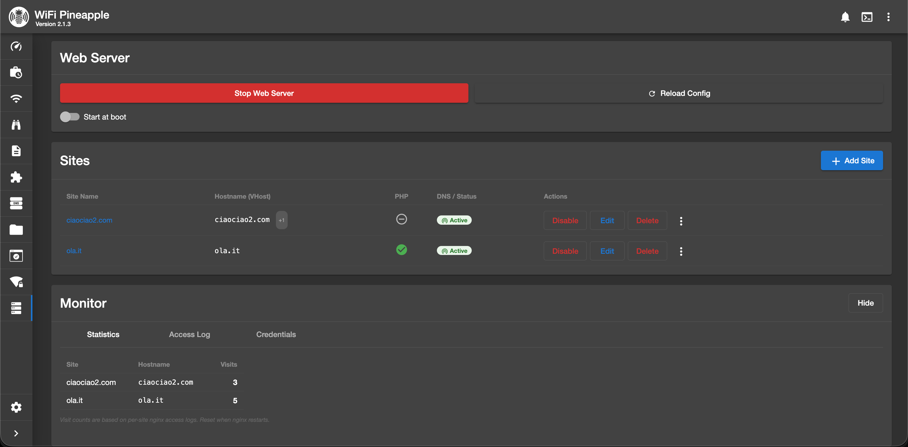
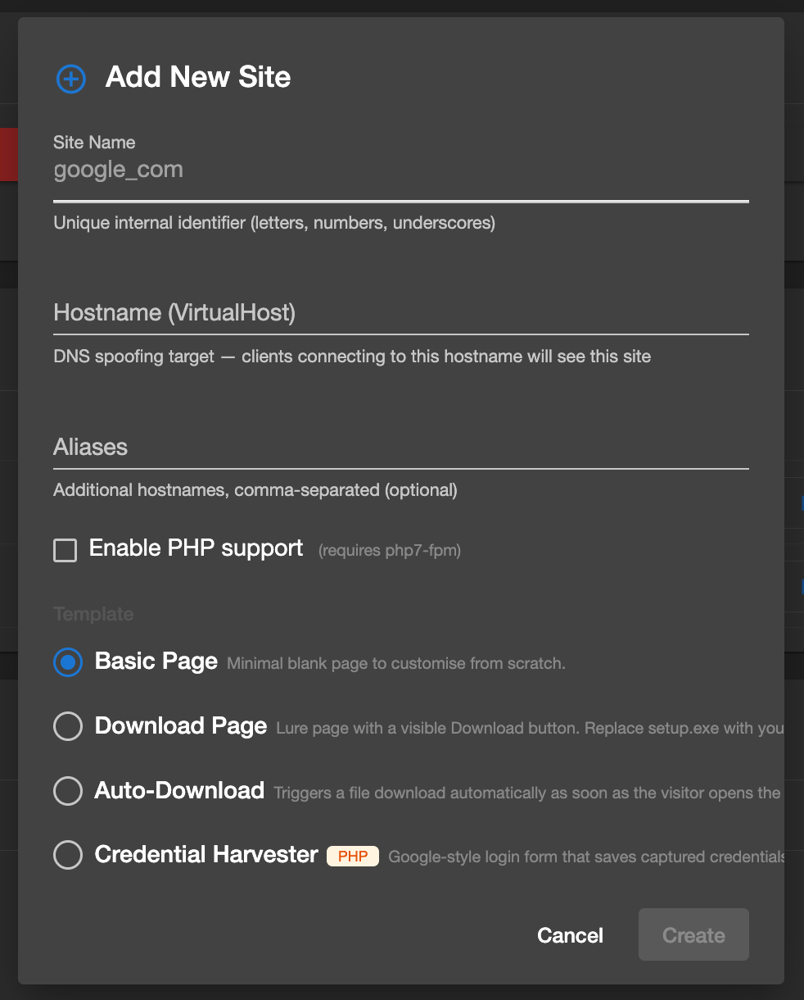
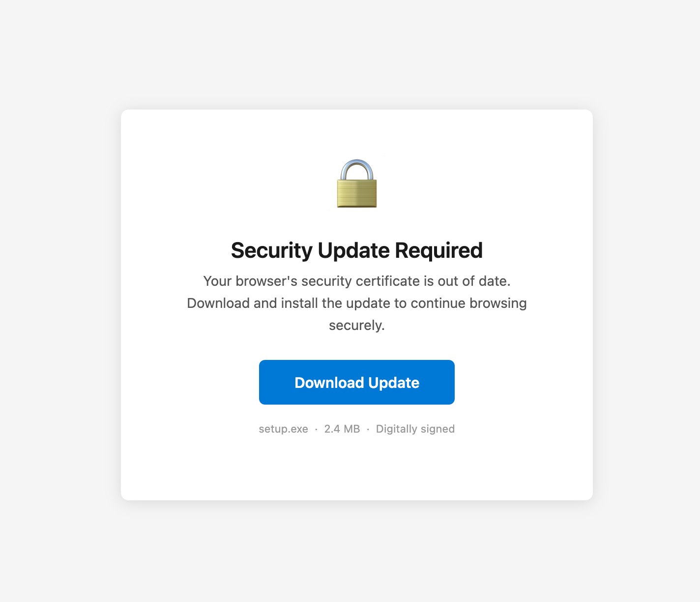
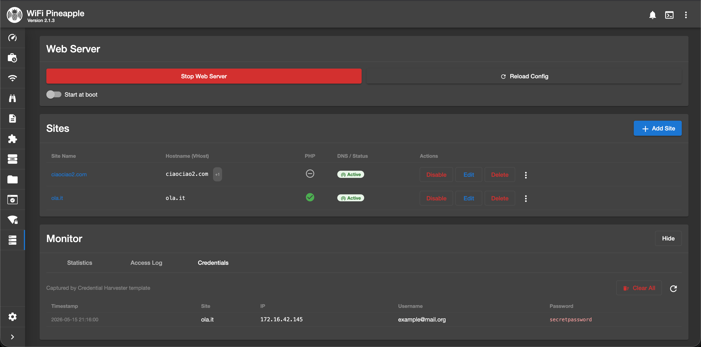
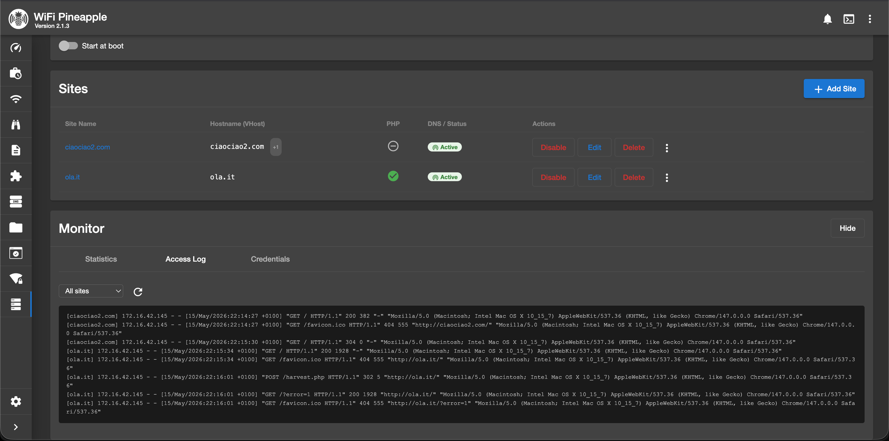

# WebServer — WiFi Pineapple MK7 Module

A WiFi Pineapple MK7 module that turns the device into a **multi-site fake web server**. It is designed to work alongside DNS spoofing: when a client connects to the Pineapple's access point and resolves a spoofed hostname, they land on a realistic fake site served directly from the device — no external infrastructure needed.



---

## How it works

```
Client connects to Pineapple AP
    │
    ├─ DNS query: fakesite.com
    │       └─► dnsmasq (Pineapple) → 172.16.42.1   ← managed automatically by this module
    │
    └─ HTTP request → nginx on the Pineapple
            └─ port 80 → serves fake site files from /root/sites/fakesite_com/
```

The module manages the full stack end-to-end:

| Layer | What happens |
|---|---|
| **DNS** | Enabling a site writes `172.16.42.1 hostname` into `/etc/hosts` and sends `SIGHUP` to dnsmasq. Connected clients resolve the hostname to the Pineapple immediately. |
| **HTTP** | nginx virtual host on port 80 serves static files (or PHP) from `/root/sites/<sitename>/`. |
| **Credentials** | The Credential Harvester template captures POST submissions via PHP and stores them in a log file. The UI reads them in real time. |

---

## Features

### Web server controls
- **Start / Stop** nginx from the UI with a single click
- **Reload Config** — apply nginx changes without restarting (zero downtime)
- **Start at Boot** — toggle to auto-start nginx on every reboot
- **Port conflict detection** — clear error if port 80 is already in use (e.g. EvilPortal, uhttpd)

### Site management
- **Add Site** — create a virtual host from a template with hostname, aliases, and optional PHP
- **Multi-hostname aliases** — a single site can respond to multiple hostnames (e.g. `portal.local` + `www.portal.local`)
- **Enable / Disable** individual sites — updates `/etc/hosts` and reloads dnsmasq automatically
- **Rename** — change the site's internal name, hostname, and aliases at any time
- **Duplicate** — clone a site with a new name and hostname
- **Delete** — removes site files, nginx config, and `/etc/hosts` entry in one action

### Workbench (file manager)
- **Browse** the site's file tree from the UI
- **Create** new files with a built-in code editor
- **Edit** existing files directly in the browser (syntax-highlighted editor)
- **Upload** any file from your local machine (binary-safe, base64 transfer)
- **Delete** files and directories

### Monitor
- **Statistics** — per-site visit counter based on nginx access logs, updates in real time
- **Access Log** — tail the last 100 lines of any site's nginx access log with a site selector dropdown
- **Credentials** — view, sort, and clear credentials captured by the Credential Harvester template

### First-run wizard
- Detects missing `nginx` / `php7-fpm` and installs them via opkg with a single click (Pineapple must have internet access)

---

## Site templates



When creating a new site you choose from four ready-made templates:

| Template | PHP | Description |
|---|:---:|---|
| **Basic Page** | No | Minimal blank HTML. Build your site from scratch in the Workbench. |
| **Download Page** | No | Lure page with a "Security Update Required" banner and a prominent Download button. Visitor must click to trigger the download. |
| **Auto-Download** | No | Download starts automatically on page load. Shows a spinner while "installing". |
| **Credential Harvester** | Yes | Fake login form. Submitted credentials are written to `credentials.log` and surfaced in the Monitor tab. The log file is protected from direct HTTP access by an nginx `deny` rule. |

### Download Page template in the browser



### Credential Harvester

Captured credentials appear in the **Monitor → Credentials** tab with timestamp, source IP, username, and password:



Credentials are stored at `/root/sites/<sitename>/credentials.log` as tab-separated values. The file is never served over HTTP (nginx denies requests for `*.log`).

---

## Access Log

The **Monitor → Access Log** tab tails the last 100 lines of any site's nginx access log. Use the dropdown to filter by site or view all traffic at once.



---

## Directory layout on the Pineapple

```
/root/sites/
├── fakesite_com/
│   ├── site.json          ← { "name": "fakesite_com", "hostname": "fakesite.com", "php": false, "aliases": [] }
│   ├── index.html
│   └── ...
└── othersite_com/
    ├── site.json
    ├── index.html
    ├── harvest.php        ← present only in Credential Harvester sites
    └── credentials.log   ← written at runtime, never served over HTTP

/etc/nginx/sites-available/fakesite_com    ← nginx vhost config
/etc/nginx/sites-enabled/fakesite_com      ← symlink → sites-available (when enabled)
/tmp/webserver_access_fakesite_com.log     ← per-site access log (in RAM, reset on reboot)
```

`/etc/hosts` block (managed by the module, preserved across enable/disable cycles):
```
# webserver-module-start
172.16.42.1 fakesite.com
# webserver-module-end
```

---

## Install

### 1 — Download the release

Download the latest `webserver.zip` from the [Releases](../../releases) page and extract it:

```bash
unzip webserver.zip
cd webserver
```

The archive contains the pre-compiled UI bundle, the Python backend, and all site templates — no Node.js or build step required.

### 2 — Copy files to the Pineapple

Replace `172.16.42.1` with your Pineapple's IP if it differs.

```bash
HOST=root@172.16.42.1
BASE=/pineapple

scp webserver.umd.js   $HOST:$BASE/ui/modules/webserver/ &&
scp module.py          $HOST:$BASE/modules/webserver/module.py &&
scp module.json        $HOST:$BASE/modules/webserver/module.json &&
scp -r assets/         $HOST:$BASE/modules/webserver/
```

### 3 — Start the module

The Pineapple does **not** start module.py automatically the first time you install. SSH in and start it once:

```bash
ssh root@172.16.42.1
PYTHONPATH=/usr/lib/pineapple python3 /pineapple/modules/webserver/module.py &
```

After that, enable **Start at Boot** in the UI and the module will start automatically on every reboot.

---

## Build from source

Only needed if you want to modify the Angular frontend. Node.js ≥ 12 and npm are required.

```bash
git clone https://github.com/giuliolibrando/wifi-pineapple-webserver
cd wifi-pineapple-webserver
npm install
./build.sh
```

`build.sh` runs `ng build webserver --prod` and outputs the bundle to `dist/webserver/bundles/webserver.umd.js`. Deploy with:

```bash
HOST=root@172.16.42.1
BASE=/pineapple

scp dist/webserver/bundles/webserver.umd.js        $HOST:$BASE/ui/modules/webserver/ &&
scp projects/webserver/src/module.py               $HOST:$BASE/modules/webserver/module.py &&
scp projects/webserver/src/module.json             $HOST:$BASE/modules/webserver/module.json &&
scp -r projects/webserver/src/assets/              $HOST:$BASE/modules/webserver/
ssh $HOST "kill \$(pgrep -f 'module.py.*webserver') 2>/dev/null"
ssh $HOST "PYTHONPATH=/usr/lib/pineapple python3 $BASE/modules/webserver/module.py &"
```

---

## First use walkthrough

### 1. Install dependencies
On the first open the module shows an **Install Dependencies** screen. Click the button — the Pineapple must have internet access. nginx and php7-fpm are installed via opkg. This takes ~1–2 minutes.

### 2. Create a fake site
Click **Add Site** and fill in the form:
- **Site Name** — internal identifier used for directories and configs, e.g. `my_portal`
- **Hostname** — the DNS name clients will be spoofed to, e.g. `portal.local`
- **Aliases** — optional extra hostnames, comma-separated, e.g. `www.portal.local, login.portal.local`
- **Enable PHP** — required for the Credential Harvester template; optional otherwise
- **Template** — choose the starting layout (see [Site templates](#site-templates) above)

### 3. Customise the site (optional)
Click the site name or **Edit** to open the **Workbench**. From there you can:
- Browse the site's file tree
- Edit HTML/CSS/JS/PHP files directly in the browser
- Upload images, payloads, or any other file

For Download Page / Auto-Download templates, upload your real payload and rename it (or update the download link in `index.html`):
```bash
scp your-real-file.exe root@172.16.42.1:/root/sites/my_portal/setup.exe
```

### 4. Enable the site
Click **Enable** in the site row. This:
1. Creates the nginx symlink (`sites-enabled/my_portal`)
2. Adds `172.16.42.1 portal.local` (and any aliases) to `/etc/hosts`
3. Sends `SIGHUP` to dnsmasq — DNS takes effect immediately

### 5. Start the web server
Click **Start Web Server**. nginx starts on port 80. If the port is already in use (e.g. EvilPortal is running), a descriptive error is shown.

### 6. Monitor traffic
Expand the **Monitor** card at the bottom of the page:
- **Statistics** — visit counts per site
- **Access Log** — live nginx logs for any site
- **Credentials** — captured submissions from Credential Harvester sites

---

## Technical notes

### Why not use the DNSspoof module?
`dnsmasq` — the DNS server built into the Pineapple — reads `/etc/hosts` by default and serves those A records to connected clients. This module writes directly to `/etc/hosts` and reloads dnsmasq, achieving the same result without requiring a second module.

### Conflict with EvilPortal
Both EvilPortal and this module use nginx on port 80. They **cannot run at the same time**. If you try to start the web server while EvilPortal (or any other service) is already bound to port 80, the module shows a clear error.

### PHP
php7-fpm is started automatically when the web server starts **and** at least one enabled site has PHP turned on. It is stopped along with nginx when you click Stop.

### Credential log security
Each Credential Harvester site writes `credentials.log` into the site's root directory. The nginx vhost includes:
```nginx
location ~ \.log$ { deny all; return 404; }
```
A direct HTTP request for `credentials.log` returns 404 even if the attacker guesses the filename.

### Persistence
Site files, nginx configs, and templates survive reboots. The `/etc/hosts` block is rebuilt from the enabled sites list each time a site is enabled or disabled.

### Start at Boot
Enabling the toggle writes a block to `/etc/rc.local` that starts module.py in the background and then launches nginx. The boot flag is stored at `/root/.webserver/start_at_boot`. Disabling the toggle removes both the flag and the rc.local entry.

### View Engine (Angular build note)
The Pineapple's UI loads Angular modules via SystemJS and compiles them at runtime using the **View Engine JIT compiler**. `tsconfig.lib.prod.json` explicitly sets `"enableIvy": false` to produce a compatible bundle. Do not enable Ivy — the resulting bundle will fail to load on the Pineapple.

---

## License

MIT
